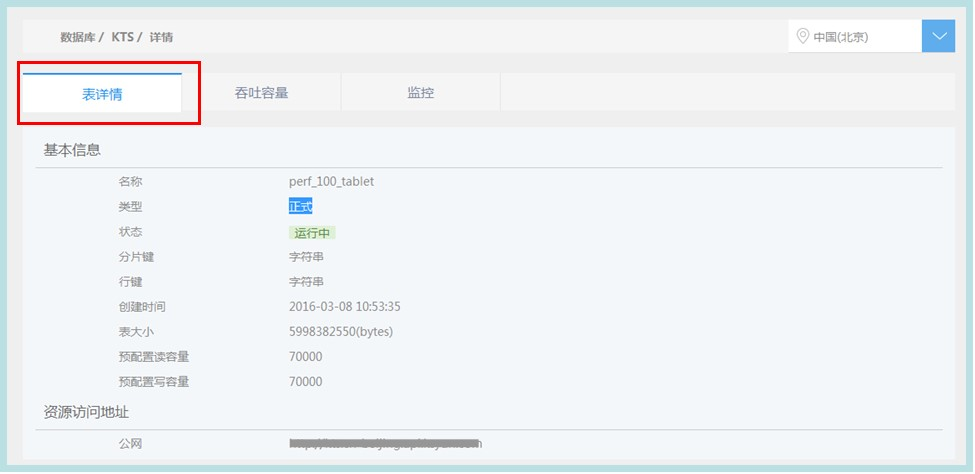
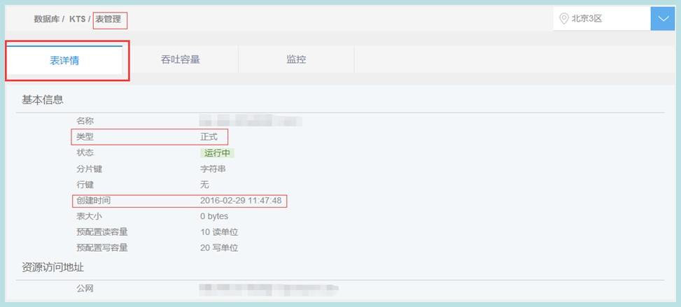
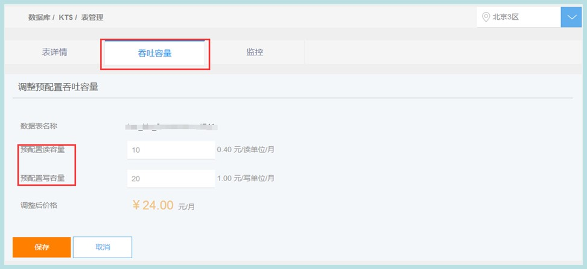

## 表管理

1. 点击列表页表名称或操作中的表管理

2. 进入表管理页，默认显示表详情 
 
 在表管理页可以进行以下操作：查看表详情、调整预配置吞吐量、查看监控

**查看表详情**

显示表的类型、创建时间等表基本信息及表访问地址。

**调整预配置吞吐量**

1. 表管理页点击“吞吐容量”
2. 填写新的预配置读、写吞吐容量

3. 点击保存，返回服务列表，新的预配置吞吐容量十秒内生效

