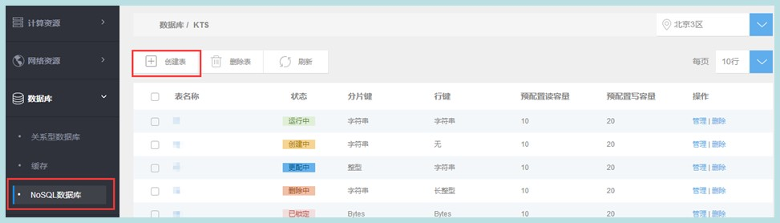

## 创建表

1. 点击服务列表页“新建”按钮（注：单个账户内同一区域内表个数须少于100），具体限制详见服务限制

2. 选择地域。
3. 填写表名称，字符集[-0-9A-Za-z_.]，首字符必须是大小写字母。长度为3-255Bytes。
4. 设置分片键（必选）、行键数据类型。
5. 配置表的读、写吞吐量（注：表格创建成功后，系统立即按照预留值开始收费）
6. 点击创建，创建成功后，进入确认表列表页。