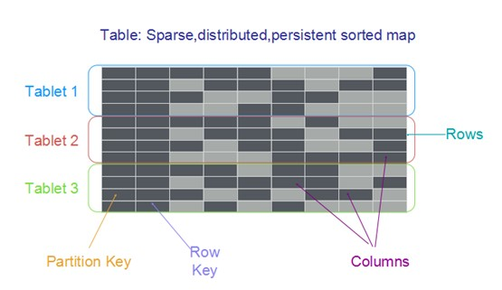

## 数据模型

KTS的数据模型概念包括表、行、主键、属性列。在KTS中，表是行的集合，而每个行是主键和属性列的集合。在关系型数据库中，表具有预定义的模式，例如表名称、主键、各列名称的列表以及各列的数据类型；表中存储的所有记录必须有相同的列集合。而KTS是NoSQL数据库：除了必须的主键外，KTS表没有固定模式，表中的每行可以有任意数量的属性列，目前我们没有单行数据总大小做限制，但是建议单行数据大小不超过400KB。

单行数据中的每个属性列都是一个名称/值对。属性列目前仅支持标量(单值)。

**主键**

创建表时，除表名称外，您还必须指定表的主键，主键是表中每一行数据的唯一标识。因此，任意两行数据的主键都不相同。KTS支持两种不同类型的主键：
* 分片键(Partition Key) 由一个名为partition key的属性构成的简单主键。KTS会根据表中每一行数据的分片键值所属的范围自动地将这一行的数据分配到对应的分片，这样具有相同分片键的行属于同一个分片，以达到负载均衡的目的。
*  分片键和行键(Partition Key、Row Key) 由两个属性列构成的复合主键。第一个属性列称为分片键，第二个属性是行键。 具有相同分片键的数据存储在相同分区。两行数据可具有相同的分片键值，但这两行数据必须具有不同的行键。 您在创建表的时候，必须明确指定主键的每个属性列的数据类型: 字符串、32位整数、64位整数或者二进制。

**属性列**

属性存放行的数据，每一行可以包含任意数目的属性列。

**命名规范**

属性列的命名规范：
1. 必须由英文字母、数字和下划线组成
2. 首字母必须为英文字母或者下划线或者数字
3. 大小敏感
4. 长度在1~64K个字符之间。建议属性列使用短小的名字。

**支持的数据类型**

KTS目前仅支持标量数据类型：bool、int32、int64、double、string、binary。

类型 | 值 | 空间占用限制
-----| ---- | ----
Bool | true或者false | 1个字节
Int32 | [-2^31, 2^31-1] | 4个字节
Int64 | [-2^63, 2^63-1] | 8个字节
Double | IEEE 754双精度浮点数据，提供15~16位有效数字：1.7x10^-308 ~ 1.7x10^308 | 8个字节
String | UTF-8编码的字符串，可以为空字符串 | 作为属性列不能超过400KB，作为主键不能超过2KB
Binary | 二进制数据，可以为空 | 作为属性列不超过400KB，作为主键不能超过2KB

**行数据大小的计算**

Table系统中每行数据都占用一定存储空间，存储空间的计算方式如下：
* 单行数据大小 = 主键的数据大小 + 属性的数据大小。
* 主键的数据大小 = 主键列的值的数据大小之和。
* 属性的数据大小 = 属性列的名字长度之和 + 属性列的值的数据大小之和。

**数据存储**

KTS将数据按照主键值的范围进行水平切分存储在分片中。也就是说KTS的表中的数据是按照主键进行全局有序存储的。分片是为表分配的存储，由固态硬盘(SSD)提供支持，并可以在金山云服务区域内的三个可用区的机器上自动进行复制。分片管理由KTS全权负责，客户不需要亲自管理分片。在您创建表时，表的初始状态为CREATING。在此阶段，KTS会为表分配一个分片。表的状态变为ACTIVE后，您可以开始读取和写入数据。 当表中的数据量接近该分片的容量上限时，KTS会为表再分配一个分片，然后将该表中的数据分配到旧分片和新分片中。此活动在后台进行，对应用程序时透明的。您添加到表中的数据越多，KTS分配的分片越多，数量足以存储表的数据。  目前KTS不会释放或合并分片。如果一个表的数据跨多个分片，那么即使您删除了大部分的数据，这些分片仍然会分配给该表。后续版本会提供分片的自动合并功能。

